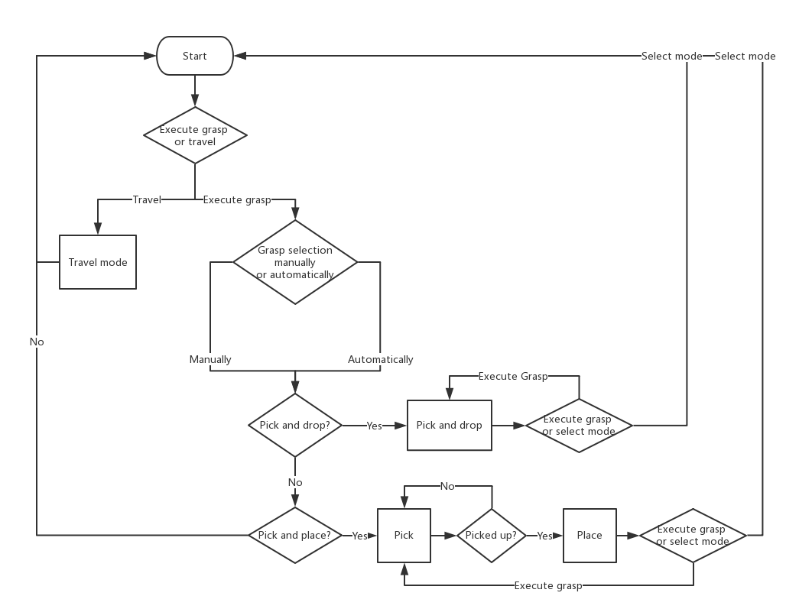
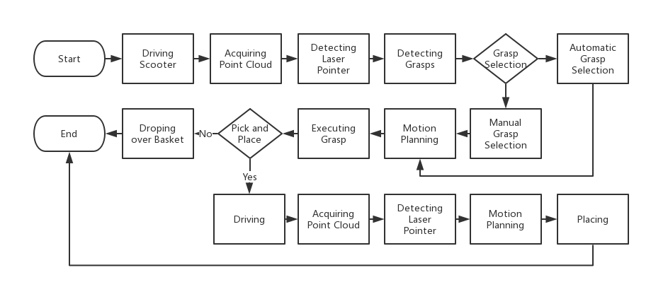

## Abstract
Many people with motor disabilities struggle with activities of daily life (ADLs), limiting their ability to live independently. This paper details a robotic mobility scooter developed to assist with manipulation-based ADLs to increase independence. We present a system comprised of a Universal Robotics UR5 robotic arm, a mobility scooter, five depth sensors, and a user interface which utilizes laser pointers. The system provides pick-and-drop and pick-and-place functionality in open world environments without modeling the objects or environment. We evaluate our system over several experimental scenarios and show an improvement relative to a baseline established for a similar system.

	
  	

The system is comprised of a Universal Robotics UR5 robot arm mounted on a Merits Pioneer 10 mobility scooter. Five StructIO depth sensors provide perception functionality for the system. The user interface, including a monitor, a key stick, and a dual laser pointer device, enable the system to interact with the user.

## Paper
Latest Version 25 Sep 2018:

Submmited to IEEE International Conference on Robotics and Automation (ICRA) 2019

Dian Wang1, Colin Kohler1, Andreas ten Pas1, Holly Yanco2, Robert Platt1

1Northeastern University

2University of Massachusetts Lowell

## Workflow
### Interface WorkFlow

	

### Grasping WorkFlow

	

## Video

	<iframe width="640" height="480" src="https://www.youtube.com/embed/-FqXRtMlc4U" frameborder="0" allow="autoplay; encrypted-media" allowfullscreen></iframe>

