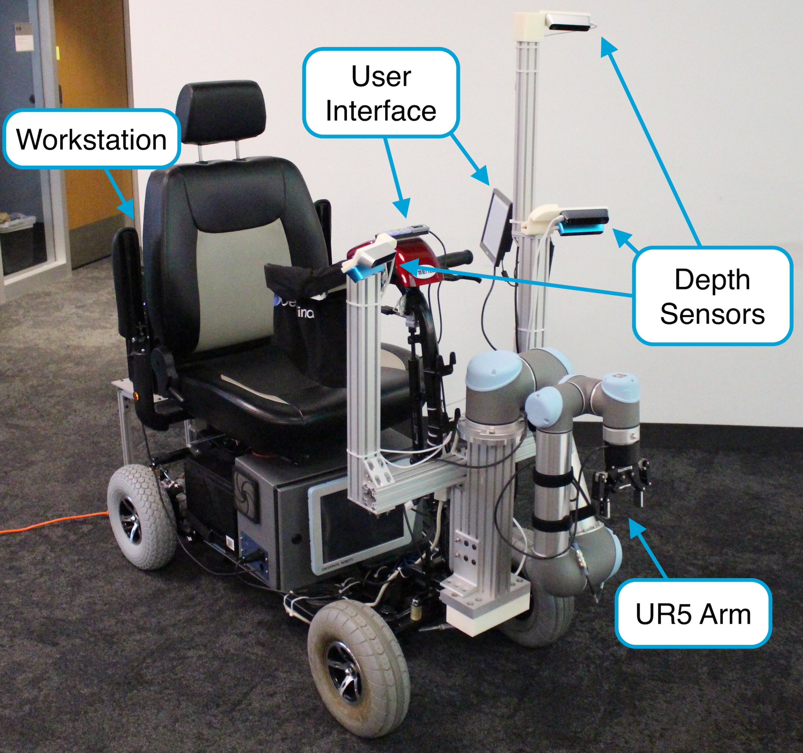
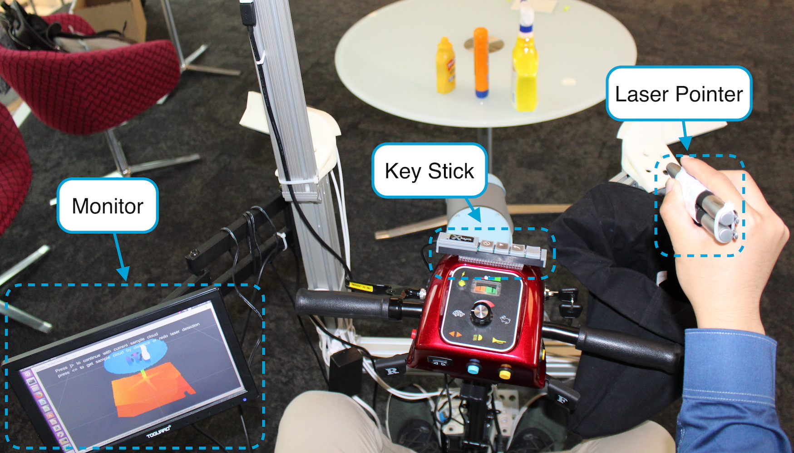

### Abstract
Many people with motor disabilities struggle with activities of daily life (ADLs), limiting their ability to live independently. This paper details a robotic mobility scooter developed to assist with manipulation-based ADLs to increase independence. We present a system comprised of a Universal Robotics UR5 robotic arm, a mobility scooter, five depth sensors, and a user interface which utilizes laser pointers. The system provides pick-and-drop and pick-and-place functionality in open world environments without modeling the objects or environment. We evaluate our system over several experimental scenarios and show an improvement relative to a baseline established for a similar system.

The system is comprised of a Universal Robotics UR5 robot arm mounted on a Merits Pioneer 10 mobility scooter. Five StructIO depth sensors provide perception functionality for the system. The user interface, including a monitor, a key stick, and a dual laser pointer device, enable the system to interact with the user.

### Video
<iframe height="600" src="https://www.youtube.com/embed/-FqXRtMlc4U" frameborder="0" allow="autoplay; encrypted-media" allowfullscreen></iframe>
